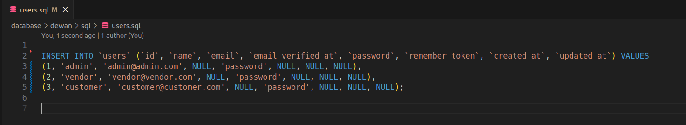

# README

here is doc


## Installation

> Run this command for install package.

```
composer require dewan/dewan-sql-seeder
```

> Run this command for config publish.

```
php artisan vendor:publish --tag=dewan-sql-seeder-config --force
```

## Basic use

### Step- 1
> Create folder named "dewan/sql" in database directory 


### Step- 2
> Download or export .sql file from database


### Step- 3
> Remove extra code.


### Step- 4
> The code look like:




### Step- 5
> Run command:  
``` php artisan dewan:sql-seed```

> The command copy all sql file to public/sql directory then run migrate:fresh and seed all data form sql file.
